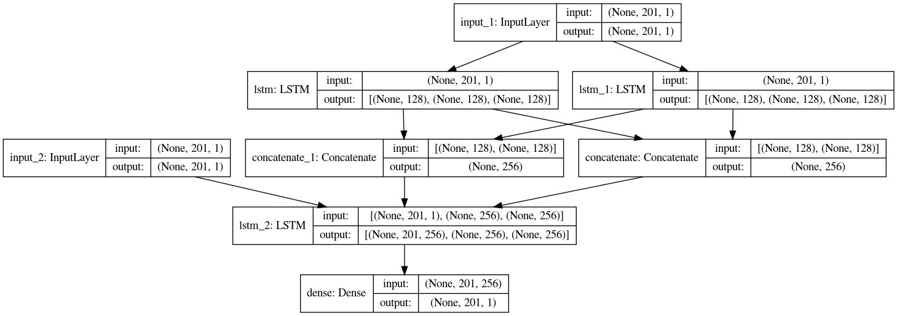
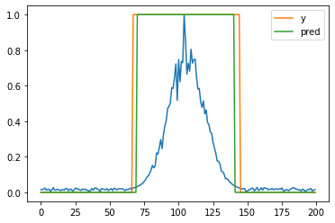

# peak-detection-by-seq2seq

- Seq2seq model for peak detection
- Bydirectional LSTM is used as encoder.
- Tensorflow/keras is used as framework.
- All data is artificial. Generating data is contained in this notebook. 
# Demo

# Requiremnets

Confirmed to work with the following versions
- numpy : 1.20.3
- tensorflow : 2.8.0
- matplotlib : 3.4.3

# Usage 

Run seq2seq.ipynb in jupyter

